Lab 2: Mapping Data with Leaflet.js, MapBox.js, and TileMill
============================================================

Ryan Mullins | [RyanMullins@psu.edu](mailto:RyanMullins@psu.edu)

# Overview

In lab 2 we switch from a data collection and preparation focus, to a data representation focus. You will cover the following topics in Lab 2. 

1. The basic components of a tiled web map.
2. The tools used to create the support content for a web map. 
3. The tools and process used to create a static web map. 


# 1 Components of a Web Map

Web maps are increasingly becoming more varied and powerful tools for conveying a message to a reader. This is due in no small part, to the advancements made in browser technology and development tools. At present, the most common web map is a tiled map (sometimes you will see them called Slippy Maps, a term popularized by OSM). Web maps made using various JavaScript graphics libraries, such as [D3.js](http://d3js.org), are becoming more popular as well. Each has their advantages and disadvantages, but this lab will focus on making tiled maps. 

A tiled map uses three two basic components &mdash; a mapping library and a collection of images, or tiles &mdash; to display a map of the world or a region at discrete zoom levels, or scales. At high zoom levels (larger scales) it is impossible to display the entire world at once, so different tiles are generated for the various zoom levels. A mapping library manages which of these tiles should be shown for a region at different zoom levels. The typical size of a tile image is 256 pixels by 256 pixels. Tiled maps are also associated with the ability to change zoom level and pan to different regions based on interactions (the term Slippy Map comes from the ability to slip between zoom levels and regions). There are a large number of closed and open source mapping libraries, including libraries from Google, Microsoft Bing, the Open Layers project, and more. In this lab we will make use of the [Leaflet.js](http://leafletjs.com/) mapping library, an open-source library released in 2011 that has quickly become the most used open-source mapping library on the web. You will also be using [TileMill](https://www.mapbox.com/tilemill/) to create the tiles that Leaflet.js will manage. 

There are, of course, some drawbacks to tiled maps. The most glaring of these is the projection that is commonly used, the Web Mercator. As you're well aware, Mercator projections suffer from severe distortion, which can cause serious misinterpretation problems whenever relative size of places or relative distances among places matters.


# 2 Creating Map Tiles with TileMill

As we discussed previously, tiled maps use a mapping library and set of tiles to display a map on a web page. The first section of this lab focuses on creating and publishing the tiles for your map to a hosting service. You will be using [TileMill](https://www.mapbox.com/tilemill/) to create your tiles, and publishing them to MapBox.  

## 2.1 MapBox Hosting Services and TileMill

[MapBox](https://www.mapbox.com/) is a company dedicated to creating web maps. Their primary function is to provide hosting services for map tiles. They offer a variety of [plans](https://www.mapbox.com/plans/), from free to premium, that allow for different volumes of storage and views. You will be using their free hosting services in these labs. Please be sure to sign up for their free plan at your earliest convenience. 

MapBox has also created a number of open-source tools to make it easier for cartographers to design and publish maps using their services. One of these tools is [TileMill](https://www.mapbox.com/tilemill/). TileMill is a free application, available for OS X, Windows, and Ubuntu Linux, that allows you to import various data sources, style them, and create map tiles. You can download TileMill from the link above. It is also available in all of the Penn State Geography Department computer labs. 

## 2.2 How To: Creating Basic Map Tiles with TileMill

Now you can get to work making tiles. This is a step-by-step walk-through (with pictures!) of how to take the data you collected in Lab 1 and transform that into tiles for a web map. 

### Step 1: Creating a New Project

First things first, time to open up TileMill (or [download](https://www.mapbox.com/tilemill/) it if you haven't done so yet). When you open TielMill you will be greeted with something similar to what's shown in Figure 2.1.

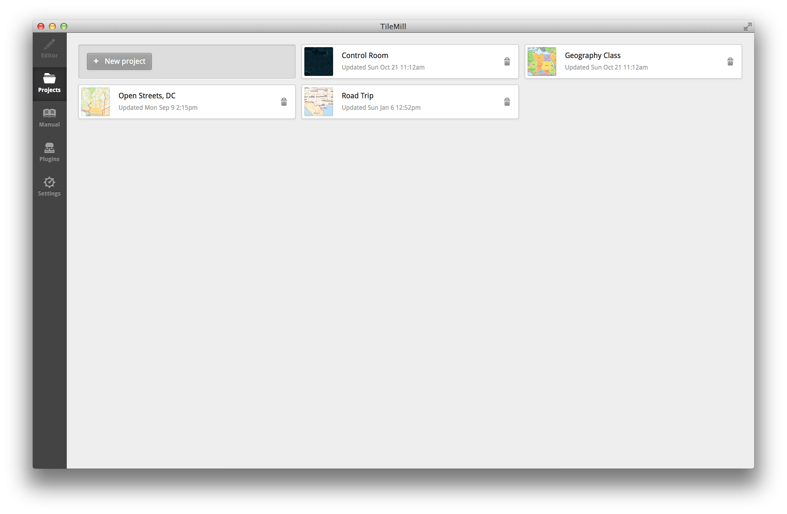

In the center you will see a series of example projects that come pre-installed. On the side is a menu that lets you switch between what is shown in the center area. The "Editor" button is likely inactive as you don't have any projects open at the moment. There are other tabs for the manual, settings, and plug-ins, of these the manual will be the most valuable to you. 

Time to make a new project. Click on the "New project" button in the upper left of the projects page (Figure 2.1). When you do this, you will be presented with a little pop-up (Figure 2.2) asking for some information about this new project. The most important, and only required, piece of information is the "Filename". Filenames can only be alphanumeric, no special characters or punctuation, and good practice is to use [CamelCase](http://en.wikipedia.org/wiki/CamelCase) notation. CamelCaseMeansTheFirstLetterOfAnyWordIsCapitalizedAndYouDoNotHaveSpacesOrPunctuationBetweenWordsLikeThis. It may seem a bit weird, but you'll get used to it. I will discuss CamelCase more in Section 3 because it is a huge part of my coding style and understanding how I use it will make things a bit easier to read and understand. 

You can use the "Name" field to give it a more readable and descriptive name. I am boring and this is a demo, so I went with the name of the course. The "Description" field is exactly what you think and can be useful, but is not required. Leave the "Image format" alone, 24-bit PNGs are awesome and the only other option is a JPEG... 

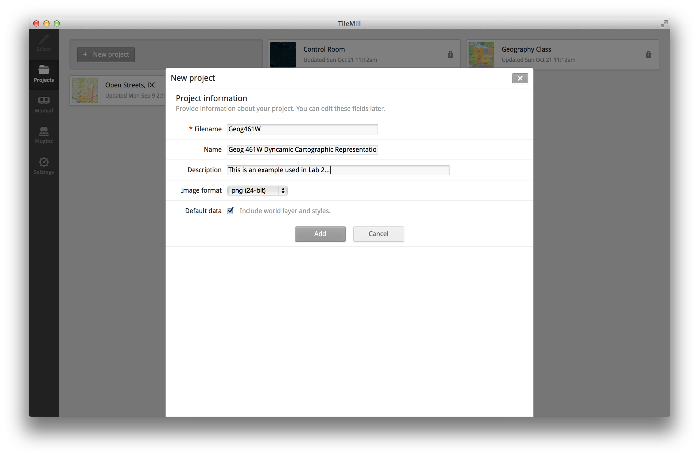

Cool. So now you have a new project to do work in. It should be shown on the "Projects" page (listed alphabetically, Figure 2.3), if it is not then something went wrong and you should try to make another one. If the problem persists, contact [MapBox Support](http://support.mapbox.com/).

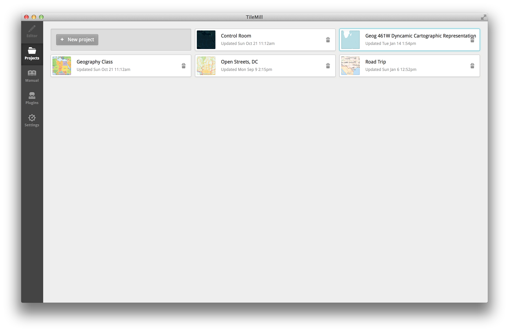

Click on the project to open it in the Editor. 

### Step 2: Adding Data Layers

And now you have a map, albeit a pretty bare one at the moment. Your project probably looks something similar to what is shown in Figure 2.4. Another quick review of the interface, in the center of everything is the map preview. This is a live rendering of what your tiles are going to look like once they are created. To the right of that is the CartoCSS editor that you use to control how your map looks, more on that later. In the upper left you will notice some interface controls. The "+" and "-" buttons control zoom level, though you can also do that with your scroll wheel. The arrows toggle between a full-screen map-view and the split map-editor view. The last piece is probably the most important, it's the editing tools menu (Figure 2.5) in the bottom left.

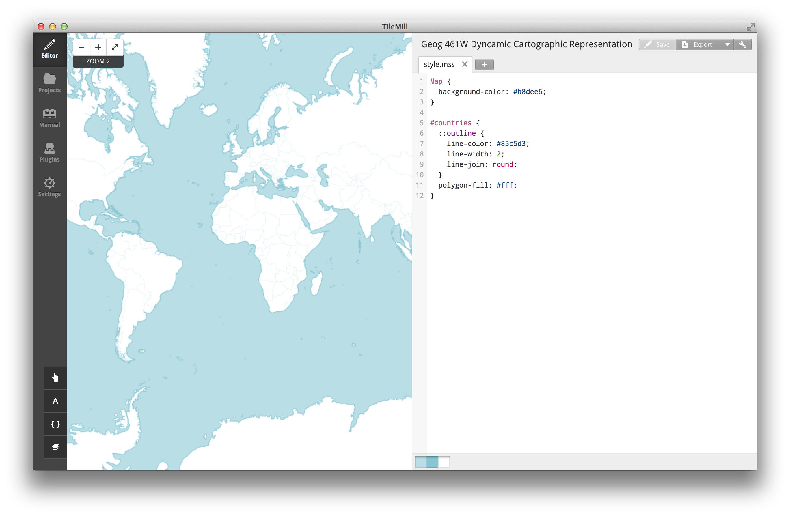

TileMill has a pretty great set of editing tools built in, going down the list... The pointing finger thing (technical term, obviously) let's you control the templates. This is where you can add a legend and even some interactivity to your maps. We will get to the interaction bits in the next lab, but the legend is pretty easy to figure out and can make a world of difference. You type in text and it makes it appear, it is that simple. You can do all sorts of advanced things too, look for more advanced tutorials [here](https://www.mapbox.com/tilemill/docs/guides/advanced-legends/).

Below the pointy finger thing is a button with the letter "A" in it. Clicking on this will bring up an absolutely massive list of all the fonts you can use in your tiles. Be careful, it is pretty easy to get lost in there. Below This is a pair of curly braces (that's "{ }" those kind, plan on becoming familiar with these), and clicking on that brings up a reference guide for CartoCSS. This is definitely going to become your friend.  

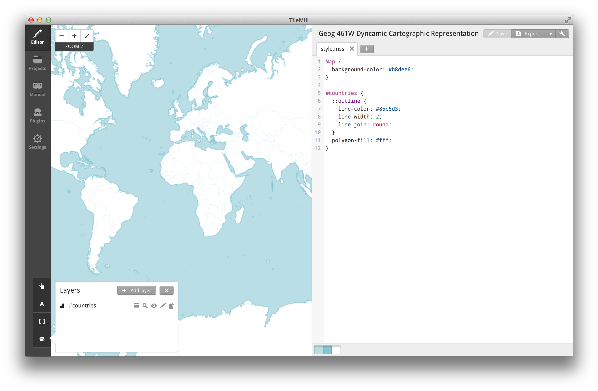

At the bottom is the really interesting bit though. It may look like a stack of papers, but it really lets you see which data layers are being used in this map. Click on it and a little pop-up appears showing the data layers in the map (Figure 2.5). You should only see the "#countries" layer in there now, how about you spice things up a bit. You are going to add a new data layer to the map, using the alaskaFires.csv as the source. Click on the "Add layer" button and a pop-up will appear, much like it did with the new project, asking for some information (Figure 2.6).

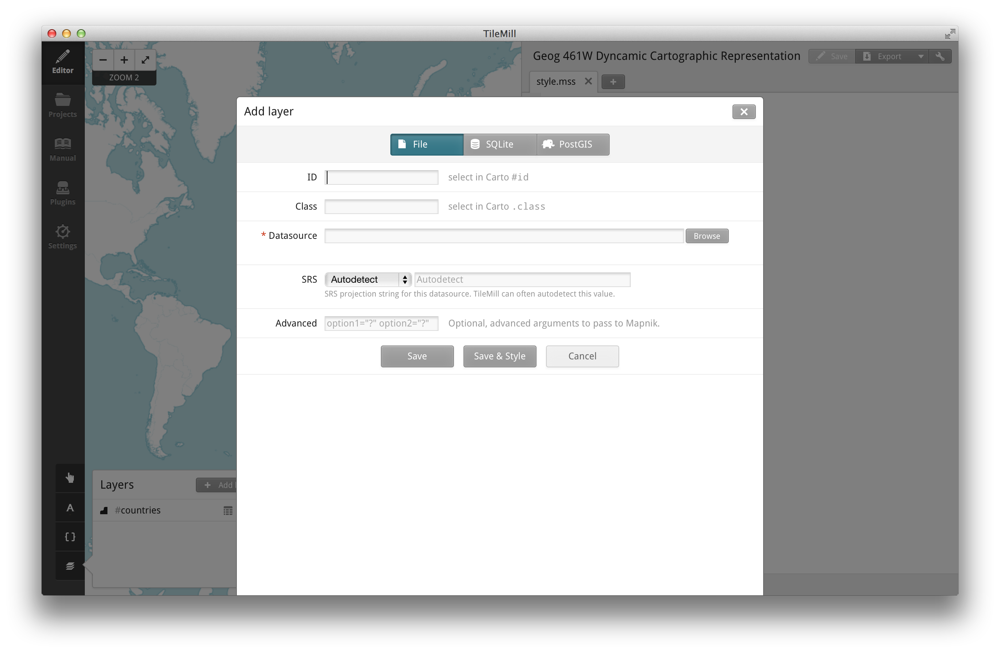

It is always easiest to start with the datasource. At the top of the pop-up you will notice three tabs &mdash; File, SQLite, and PostGIS. These are options for the type of datasource you want to use. Your datasource is the _alaskaFires.csv_ file you created in Lab 1, so you want to select the File option. In real life, or with data from your job or something like that, you might find that SQLite or PostGIS do a better job of storing and managing your data since they are designed to do just that. For these labs we are just going to focus on using files. 

Click on the browse button, navigate to where your _alaskaFires.csv_ file is on your computer, and click the "Done" button to the right of the file path. Now you can customize the ID and Class attributes for this data, if you so choose (Figure 2.7) though TileMill usually generates good names automatically. You will not need to put anything in the advanced field. When you are happy with the names, click the "Save &amp; Style" button and watch as TileMill magically adds all of those data points to the map (Figure 2.8)

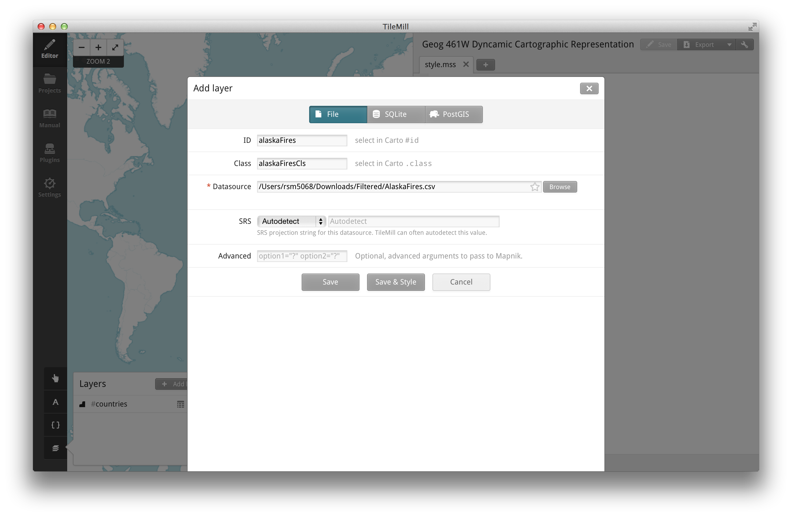

### Step 3: Styling Data Layers

At this point your map should look something like what you see in Figure 2.8. Blue ocean, off-white land masses, red dots for all the fires. While it is not necessarily bad, it could definitely look better. Next, we will look at what you can do with CartoCSS to make it look a bit better. But before we go jumping into the deep end with CartoCSS, we should probably figure out what we want to change and how we can go about doing that. 

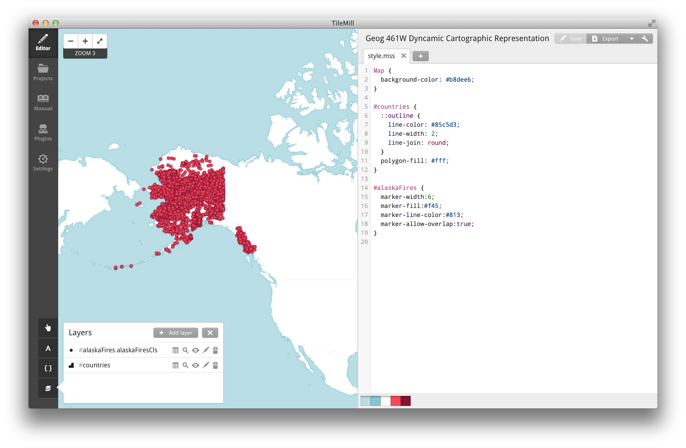

We will start by looking at the attributes of the data and trying to find something interesting to represent. If you open up the _alaskaFires.csv_ file in a spreadsheet or text editor, you will notice that it has a lot of attributes, 32 to be exact (Figure 2.9). Some of these are interesting, some of them are hard to really relate to, others are going to make life easy for making this map prettier. Some things that stick out to me as "making life easier attributes" are "ORGANIZATION", "SIZECLASSN", "PROTECTION", and "FIRETYPE". Each of these is represented by a small number (less than 10) of unique values. We have four attributes to choose from... but which one to choose?

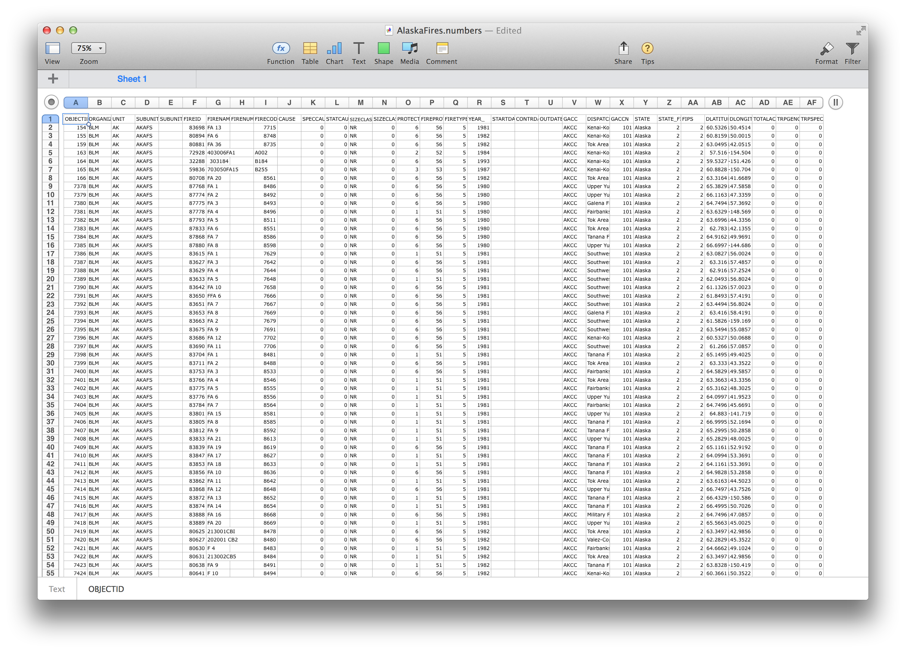

I tend to like themes. One theme that occurred coincidentally for me is that all of the fires were initially colored red, which is kind of what fire looks like in nature. We want to keep this theme going, but instead of a single color why not have different colors based on some attribute related to the fire... like its size classes. So, we have an attribute, "SIZECLASSN", that defines 8 discrete size classes with values ranging from 0 to 7. 

Next step: colors. The Penn State Geography has a rich history of color research. The seminal outcome from this being [ColorBrewer](http://colorbrewer2.org), a collection of some proven and tested recommendations for color schemes to use on maps. The "SIZECLASSN" data is sequential with 8 classes, and since it deals with fire we want to use a color scheme that conveys that. On ColorBrewer I select 8 class breaks, a sequential scheme, and see what looks like fire. In the multi-hue category there is a nice gradient that goes from yellow to red, much like fire. Now we have everything we need to make the data pretty, time to write some CSS-like stuff. 

Back in TileMill make sure you can see the CartoCSS editor. You should see three little sections of code &dash; `Map`, `#countries`, and something similar to `#alaskaFires`. These are blocks of CSS that define the style for the specified selector. Lab 0 covered selectors in the context of HTML, but here they function a bit differently. In CartoCSS each selector defines the style for a layer, given that layers ID using the "#" character, or a class of features, given the class name after a "." character. At the moment you have two selectors, "#countries" and "#alaskaFires", that define the style for a layer. Inside of the curly braces for each of these selectors you see some properties that are being defined. Look at the `marker-fill-color` property in the `#alaskaFires` selector. This property controls the fill color of the circle markers for the fires, and we want to set the color based on the "SIZECLASSN" value for each fire.  

To do this you need need to make use of conditionals, a feature of CartoCSS that functions just like conditional in JavaScript. The conditional syntax goes like this: `[nameOfAttribute conditionalOperator value] { property: value; }`. You can use this syntax to create conditional appearances for any attribute of any data layer in your map. 

You need to make 8 conditional statements, one for each class, that sets the `marker-fill-color` property for each class, being sure to use the hexadecimal color values from ColorBrewer. You can see the exact code I used to do this in Figure 2.10. Once you write these click the "Save" button in the top right corner and watch the map refresh, you should see something like what I have created in Figure 2.10. 

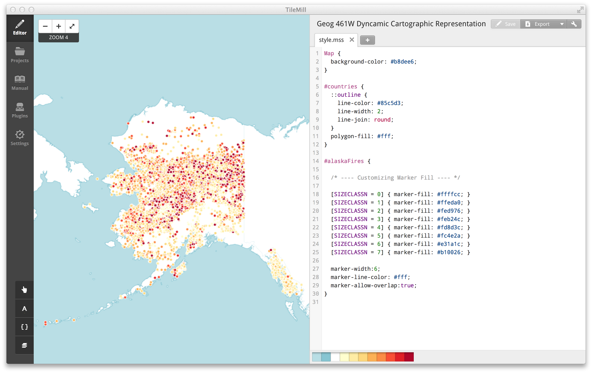

And that is all you need to do to customize the appearance of your map. You can do this to any attribute you like... and you will for the deliverable, but we will discuss that later. Right now you need to generate your tiles and publish them to a place where you can access them. 

### Step 4: Publishing Tiles to MapBox

Data: check. 

Tile design: check. 

Now to generate and publish them. Luckily, TileMill provides all sorts of functionality to do this using their Export system. In the upper right corner you will see the "Export" button, clicking on it will bring down a drop-down list (Figure 2.11). The first option, "Upload", is the one you want, but the ones below it allow you to create a series of images locally that you can transfer to a server you have set up. 

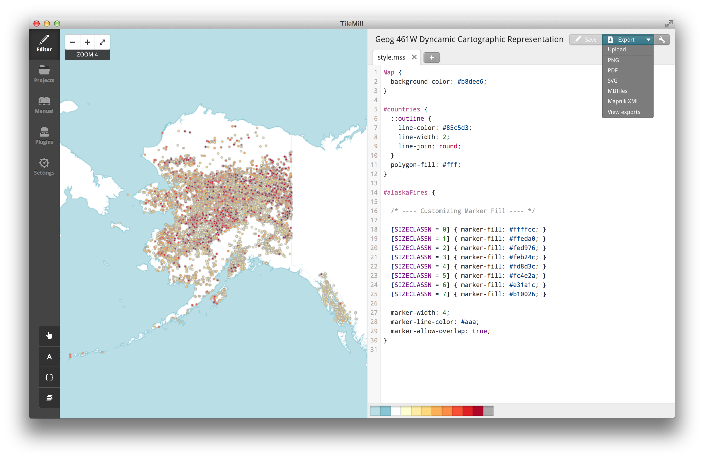

After you select the "Upload" option one of two things will happen. If you have not linked TileMill to your MapBox account, you will be asked to do so. This is just a simple form asking for your email and password to log in to your MapBox account. TileMill is only ever granted permission to upload tiles to your account, and to remove existing tiles from it; it cannot change you password, personal, or billing information. 

The second option if for the exporter view to show up (Figure 2.12). This view allows you to select the region and zoom level range that you want to export, while adding metadata (name, description, and attribution) and setting the default map center. 

Perhaps the most important piece of information in this view is the size of the exported tiles, measured in bytes of data and located below the zoom level selector. Unless you chose to pay for more, you signed up for a free MapBox account at the beginning of this lab. This gives you 50MB of data storage, so you need to be conscious of how much space any one project is taking up on your account. The only real way to control size is to adjust the region and zoom levels. 

Region is selected by manipulating the edges of the box in the middle of the screen. You can move each edge independently, or hold down shift while clicking and dragging to make a completely new selection. Zoom level is selected using a slider. You can choose any range from level 0 (the entire world) to level 22 (about the footprint of the average American house). The trick for this lab is to make it so that you don't use all of that 50MB of storage. 

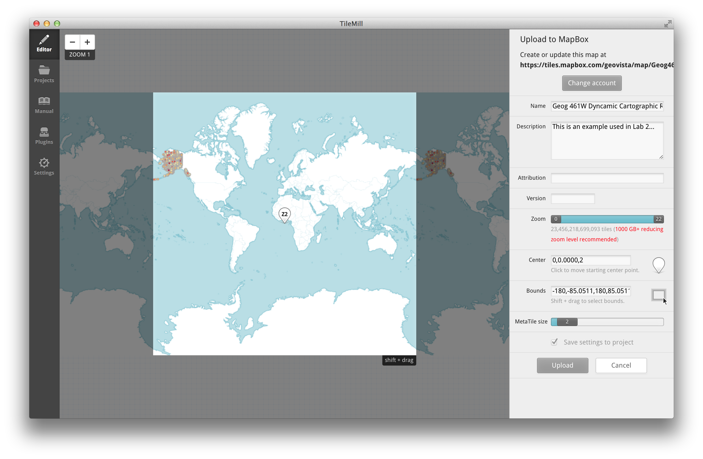

I did some playing around while writing this lab and I think I found some decent settings (Figure 2.13). Since we are only concerned with Alaska, the first thing I did was constrict the export view to that region, roughly -180,50 to -129,72. Next I looked to find exactly which zoom levels would be useful. Zoom level 4 was pretty much the bare minimum for making it large enough to see details when the map loads. The upper limit was a bit more difficult. I found that level 9 offered enough detail that you could see individual fires well enough and kept the export size under 10MB. Levels 10 and 11 also seemed to work, but they pushed the total export size over 10MB, though not too far. Your choice might be different based on the data you chose to include. Including lots of information on smaller features like airports and infrastructure could require a higher maximum zoom level. Just be cautious in your decision. Next you set the map center point. To do this simply click in roughly the center of the bounding box for your map extents and it will drop a pin in the box. There should bet text in the pin, something like Z4, which is the zoom level at that point. Together, the location of the pin and the text within it mean that the map will automatically center at that location and show the tiles at the zoom level number when loaded using MapBox.js. There is also a version field, but I would not use it as it tends to just cause problems. 

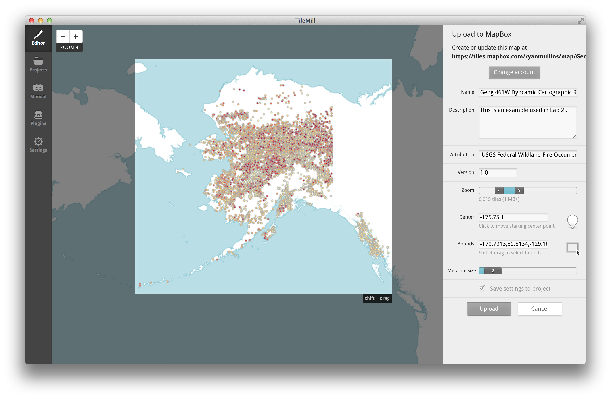

Once you figure out the parameters of your export (don't forget to attribute your sources), click on the "Upload" button. This process can take a while, especially if your export covers a larger zoom range. When it is completed the View Exports window will update with a button to view the map on MapBox.com (Figure 2.14). Click this button and see how it looks.

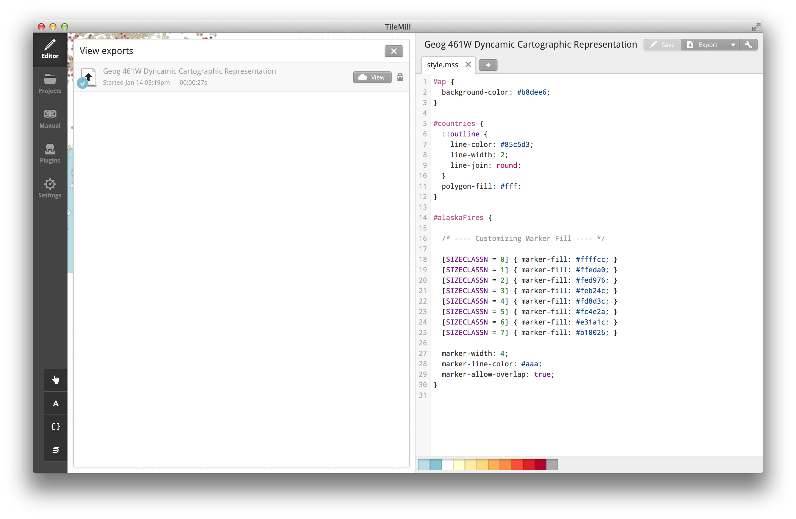

## 2.3 Advanced Topics and Tutorials

This lab has just barely scratched the surface of what can be done with TileMill. There is a slew of more advanced examples on the TileMill web page. You can check them out [here](https://www.mapbox.com/tilemill/docs/guides/add-shapefile/).

## 2.4 Deliverables

And so concludes Section 2 and Part A of Lab #2. The deliverable for this labs has three parts:

First, simply create a free MapBox account. You will need this later on and it provides me an easy way to check your progress through Part A.

Second, create map tiles for the data you downloaded in Lab 1 using TileMill and publish them to MapBox. The data included on these tiles should include the fire data from the walk-through above, as well as some representation of the extra dataset(s) you collected in Lab 1. 

Third, submit an update in the Lab 2 Part A dropbox containing a link to the tiles you made on MapBox.com (found using the link from the View Exports view). 

Grading information can be found in Section 4.


# 3 Making a Web Map

And now for something completely... related. Part B of this lab, covered in this third section, gets into actually making and publishing a web map. You will be using the Leaflet.js mapping library and the MapBox.js plug-in for Leaflet to make a map from the tiles you created. 

## 3.1 Leaflet.js and MapBox.js

Leaflet.js is an open-source mapping library created in 2011 by Vladimir Agafonkin, then working at CloudMade. It was an extremely lightweight library that handles tile management, basic interaction (panning and zooming), and provides simple classes for various data overlays. But maybe the biggest advantage of Leaflet was the plug-in support. Making plug-ins for Leaflet is incredibly easy, and the community quickly started creating them to handle anything that Leaflet did not support out of the box. 

MapBox.js is one of those plug-ins. It was created to simplify the integration process with MapBox services. So, if you host your tiles on MapBox, like you did in Part A, you can simply provide a unique ID to the MapBox.js plug-in and it will handle most everything for you. 

## 3.2 How To: Creating a Simple Web Map

Time to start using these tools. Below is another step-by-step walk-through, like the one from Section 2.

### Step 1: Downloading the Source Code

Before you do anything else, you should download some source code I prepared. To download, go to the [repository on GitHub](https://github.com/RyanMullins/Geog461W.SP2014.Labs) and click the "Download ZIP" button along the right side of the screen (Figure 3.1). This will download a ZIP archive of the entire repository onto your machine. Unzip this archive and navigate to the _Lab2/Code_ directory. This directory contains a single file, yourNameHere-FireMap.html, open that file in your text editor (if you do not have one, I recommend [Sublime Text](http://www.sublimetext.com/2)). 

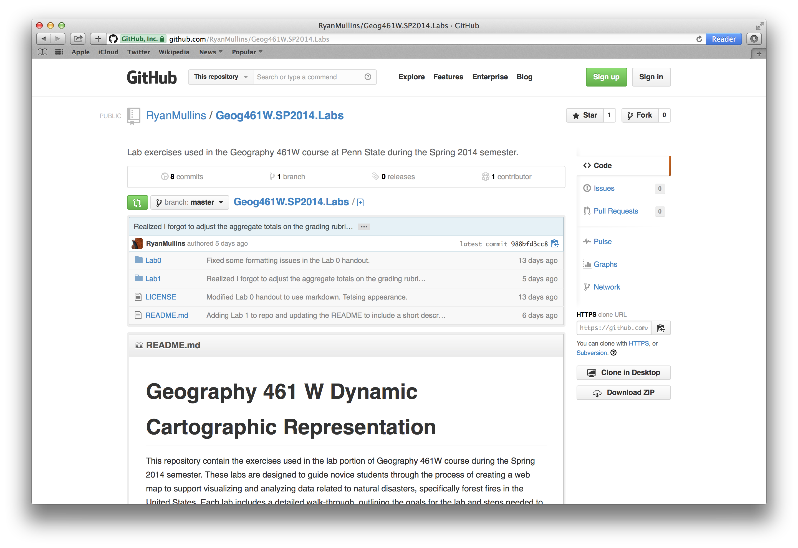

### Step 2: Importing the Leaflet.js Library and MapBox.js Plug-In

The first order of business should be to rename the file you just opened. It will make things a lot easier for me to grade if you use the naming convention I showed in the example. Simply do a save as and rename the file to include your name (first, last, both, however). Now that the file is ready to go, let us take a look at exactly what is going on inside it.

This file is an HTML file, which means it can contain any mix of HTML markup, JavaScript code, and CSS styling information. At the moment, the page contains a combination of HTML and CSS, with a placeholder for some JavaScript. Below is a copy of all of the markup and CSS in the file, and just in case anything starts going sideways on you just replace the contents of the file with this and start over. Let's go through the contents (mostly) line by line. 

```HTML

<!DOCTYPE html>
<html lang="en">
<head>
    <meta charset="UTF-8">
    <meta name="description" content="Geog 461W Lab 2: Fire Map">
    <meta name="author" content="">
    <meta name="keywords" content="">

    <title>Geog 461W | Lab 2 | Making a Fire Map</title>

    <style type="text/css">
        body {
            padding: 0px;
            font: 14px "Futura", "Lucida Grande", Helvetica, Arial, sans-serif;
            margin-right: auto;
            margin-left: auto;
        }

        h1 {
            text-align: center;
        }

        a {
            color: #00B7FF;
        }

        footer {
            text-align: center;
        }

        #map {
            width: 500px;
            height: 500px;
            margin-right: auto;
            margin-left: auto;
        }
    </style>
</head>
<body>
    <h1>Fire Map</h1>
    <div id="map"></div>
    <footer>
        Data Courtesy <a target="_blank" href="http://wildfire.cr.usgs.gov/firehistory/data.html">USGS Federal Wildland Fire Occurrence Dataset</a><br/>
        <!-- Attribute you data here -->
    </footer>

    <script type="text/javascript">
        
    </script>
</body>
</html>

```

From the Lab 0 handout you should be familiar with the syntax you're seeing; a series of HTML elements, some with and others without content. The first line defines the type of document that the browser is seeing, in this case HTML 5. Following this is the header information. This includes metadata about the page (all of those `<meta>` tags), the title for the page displayed in the tabs for the browser, and then some style information. You should take the time to fill in the metadata about the author and keywords. You do not need to worry about anything else, for now, unless you really dislike my title. 

Below the header information is the body. I have kept this pretty simple. There is a `<h1>` with the title for the page, a `<div>` named "map", a `<footer>`, and an empty `<script>` element. You will use the `<footer>` as a secondary space to list data attribution. Feel free to add the name and source for the data you chose in Lab 1 at any time. The `<div>` will be used by Leaflet.js as a placeholder to put the map in. We will discuss the `<script>` element further in the next step.

At this point, you may have a glaring question in your mind: how do we use Leaflet.js and MapBox.js??? At the moment you cannot. You need to import the libraries before we can use them. Lucky for us, the kind folks at MapBox wrapped Leaflet.js into their plug-in, so when you import MapBox.js you also import Leaflet.js. Below are the elements to import the MapBox.js library and the styles associated with it. Copy and paste these into the file above the `<style>` tag in the header (roughly line 10). 

```HTML

<script src='http://api.tiles.mapbox.com/mapbox.js/v1.6.0/mapbox.js'></script>
<link href='http://api.tiles.mapbox.com/mapbox.js/v1.6.0/mapbox.css' rel='stylesheet' />

```

And now you are ready to make a map. 

### Step 3: Creating a Map Using JavaScript

This step requires you to write just a little bit of code. I understand that some of you may have never written code before. Do not worry about it, I plan on explaining everything you need to write before you write it, and hopefully it will make sense. 

The code below creates a new map and then sets some interaction parameters. 

```JavaScript

var map = L.mapbox.map("map", "YourUserName.SomeTileID", {
    'maxZoom' : 9,
    'minZoom' : 4
});

map
    .setView(L.latLng(61, -160.5), 4)
    .setMaxBounds(L.latLngBounds(L.latLng(50,-180), L.latLng(72,-129)));

```

Walking through this bit of code... The first thing it is doing is creating a new variable named "map". You will not make use of this variable in this lab, but it will become critically important in the next lab. The variable is being initialized to the value returned by Leaflet's `map()` function. This `map()` function has been customized by MapBox to take two parameters. The first is a string and contains the name of the element that Leaflet should throw map-related content into, in this case the `<div>` element named "map". The second is a string that contains your MapBox account user name, followed immediately by a dot, followed by the unique ID for the tiles your map will use. Finally, we set a few options, including the minimum and maximum zoom levels, feel free to adjust these if you used a different zoom level range. Once `map()` does its thing, it returns a reference to the map that was just created and the "map" variable now references this. We can now set some extra properties of this map to make it easier to use.

We start with a call to the map's `setView()` function. This makes sure the map is (for the most part) centered over Alaska and set to the appropriate zoom level. Next, we call the `setMaxBounds()` function, which sets the maximum and minimum latitude and longitude that can be seen on the map. This is important since we only chose to export a subset of tiles, so going beyond the bounds we chose will mean that tiles cannot be shown and the user might get lost in the middle of nowhere. 

Copy and paste these lines of code into the `<script>` tag, roughly on line 49. Then, in TileMill, open the "View Exports" view and click the "View" button to see your map on MapBox.com. In the URL you will see something like `tiles.mapbox.com/v3/YourUserName.SomeTileID/aBunchOfOtherStuff`, copy the YourUserName.SomeTileID and paste it in place of the same portion of code that you just copied into the `<script>` tag. Save your work, and open the file in your web browser of choice. You should see something like what is shown in Figure 3.2. If you do, you are on the right track. If you do not, something went wrong and you should either come see me or try and use some of the debugging techniques discussed in Lab 0. 

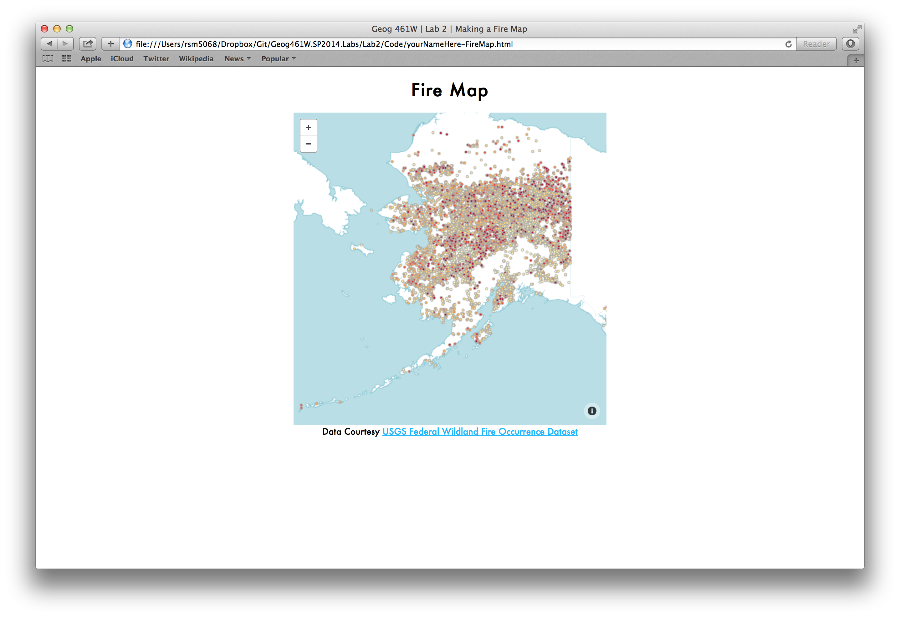

### Step 4: Publishing to a Server 

The last step in this is to upload it to a web server. In Lab 0 you should have activated your Penn State Personal Web Space. We will use this to host your map, all we need to do is move the file into position. 

Like would be a strong word, but I tend to make the most use of the web interface to the PASS system (the system of services that include your Personal Web Space), called the [PASS Explorer](https://explorer.pass.psu.edu). You log on to this service using your regular Penn State Access Account user name and password. Once you have logged in you are shown a list of directories (names in square brackets) and files in the center, and a series of tools and action to act upon these files and directories. 

Double click on the directory that reads "[ www ]". This is the root directory for your web space and we will be storing the HTML files you create in here. At this point check to see if there is a file named something like "index.html". If there is delete it, this will make it so that when you hit the root directory from a web browser everything shows up like a file listing on your computer (e.g. Finder on OS X, Explorer on Windows, etc.). Now click on the "Upload" button on the left. Select browse from the pop-up that will appear, navigate to and select the file you've been working in, and upload it to your personal web space. 

Now open a new tab in your browser and navigate to your personal web space, it should be something like www.personal.psu.edu/abc1234. From here you should see a listing of files. Select the map you just uploaded. When the page loads it should look just like it did in Figure 3.2 at the end of Step 3. If it does, you are done with Part B. If it doesn't, you should either come see me during office hours or try the debugging suggestions found in Lab 0. 

## 3.3 Web page Customization

Obviously, this page is pretty empty, you might even not like the design I have provided. If you want to add a bit more flair or change things around, you can easily do this by changing the CSS or adding a bit more content to the body. One thing to consider is making the map full screen. Mike Bostock has a simple example on how to make a map fullscreen, you can find it [here](http://bl.ocks.org/d3noob/7654694). Play around a bit and see what you can do.

## 3.4 Deliverables

Like Part A, this part of the Lab 2 has three parts. 

First, complete the walk-through to Step 3, to create a stand alone web page with a map on it. This should be able to show your map in a browser from any locally hosted environment.

Second, upload this file to your Penn State Personal Web Space. It should be publicly accessible and look identical to the map that is shown when you test locally.

Third, submit an update to the Lab 2 Part B dropbox on Angel, including a link to the map on your personal web space.  


# 4 Deliverables and Grading 

**Lab 2 Part A (03 Feb 2014)**

This deliverable has three parts:

1. Create a free MapBox account.
2. Create map tiles for the data you downloaded in Lab 1 using TileMill and publish them to MapBox.
3. Submit an update in the Lab 2 Part A dropbox containing a link to the tiles you made on MapBox.com.

**Lab 2 Part B (10 Feb 2014)**

This deliverable has three parts:

1. Change the code provided with this lab to use the map tiles you made in Part A.
2. Publish the code you have written to your Penn State Personal Web Space.
3. Submit an update in the Lab 2 Part B dropbox containing a link to the map on your web space.

**Lab 2 Writing Assignment (03 Feb 2014)**

Please generate a short essay (175-200 words) based on the instructions below (as a Word document) and upload to the dropbox. A first draft is due at 8:00 Mon 03 Feb 2014; the final, revised final version is due at 8:00 Mon 10 Feb 2014.

This part of the assignment is the core written component of the project. In keeping with the ‘W’ designation for the course, you will receive feedback on both the substance of your answer and the quality of the writing. For this first lab, you will have an opportunity to revise your answer based on feedback you will receive on the writing (comments on the draft will focus just on the writing, not the content; the content and the writing will be assessed for the final version).

This part of the assignment is worth 10 points &ndash; allocated for both your answer and the quality of the writing (once revised).

**Grading**

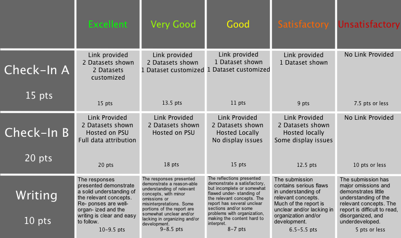
